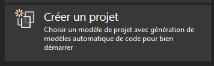
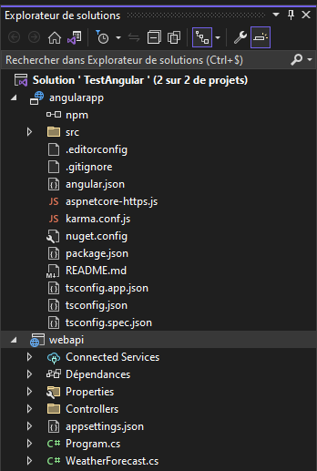
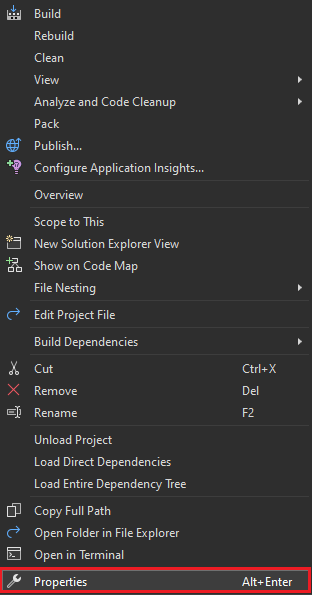
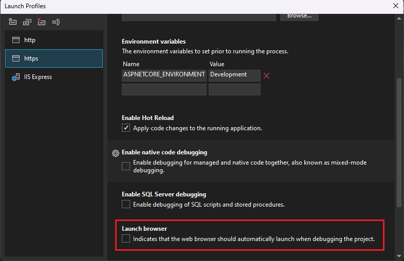

# _Web Application - Angular_

## **Créer une application `ASP.NET Core` avec `Angular` dans Visual Studio**

Comment créer un projet **`ASP.NET Core`** en tant que back-end d’API et un projet **`Angular`** en tant qu’interface utilisateur, d'après la documentation de Microsoft.

Lien vers le tutoriel Microsoft : [https://learn.microsoft.com/fr-fr/visualstudio/javascript/tutorial-asp-net-core-with-angular?view=vs-2022](https://learn.microsoft.com/fr-fr/visualstudio/javascript/tutorial-asp-net-core-with-angular?view=vs-2022)

---

### **Prérequis :**

A installer :  

* **`Visual Studio 2022`** version **17.5** ou ultérieure avec **`ASP.NET`** et **`web development`**
* **`npm`** ([https://www.npmjs.com/](https://www.npmjs.com/)), qui est inclus dans **`Node.js`**  
* **`Angular CLI`** ([https://angular.io/cli](https://angular.io/cli))  

---

### **Créer l'application front-end :**

1. Dans la fenêtre de démarrage, sélectionnez **Créer un projet**.  

   

2. Recherchez **`Angular`** dans la barre de recherche en haut, puis sélectionnez **Angular et ASP.NET Core (préversion)**.

   .png)

3. Donnez un nom à votre projet et à votre solution, puis choisissez **Créer**.

   Une fois le projet créé, l’Explorateur de solutions doit ressembler à ceci :

   

---

### **Définissez les propriétés du projet :**

1. Dans l’Explorateur de solutions, cliquez avec le bouton droit sur le projet ASP.NET Core et choisissez **Propriétés**.

   

2. Dans la page Propriétés, ouvrez l’onglet **Déboguer** et sélectionnez l’option **Profils de lancement de débogage**. Décochez l’option **Lancer le navigateur**.

   

   Cela empêche l’ouverture de la page web avec les données météorologiques sources.

---

### **Démarrer le projet :**

Pour démarrer le projet, appuyez sur **F5** ou sélectionnez le bouton **Démarrer** en haut de la fenêtre. Deux invites de commandes s’affichent :

* Le projet API ASP.NET Core en cours d’exécution
* L’infrastructure CLI Angular exécutant la commande ng start

---
